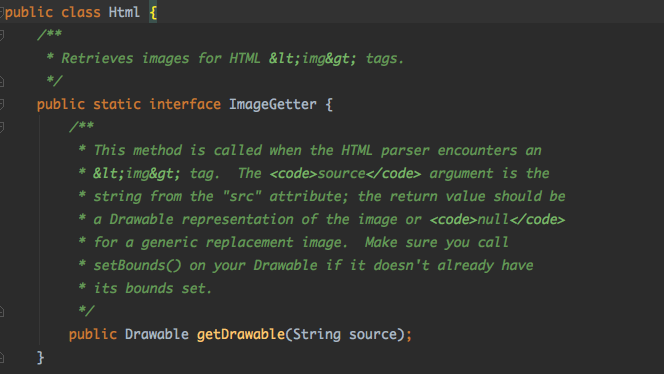
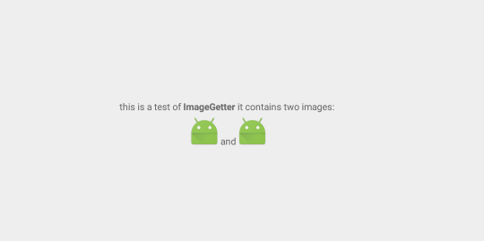

# 1. 使用ImageGetter的场景
   Android中用于显示文本的控件为textView，textView不仅仅能显示文本，同时也能显示富文本，即一些包含html标签的文本。
   
	 //显示普通文本
	 textView.setText("普通文本");
	 //显示html富文本
	 textView.setText(Html.fromHtml("<b>普通文本</b>"))
	 //显示html富文本且包含图片
	 textView.setText(Html.fromHtml("<b>普通文本</b></img>", imageGetter, tagHandler))
# 2. ImageGetter介绍
  
  
  ImageGetter是一个接口，主要用于解析 ""里的src属性，返回drawable，再使用drawable时需要确保drawable里有大小即Bounds

# 3. 简单示例 
*   新建activity

~~~java
public class TestImageGetter extends Activity {
    
private TextView tv;
private static final String url1 
= "https://ss1.bdstatic.com/kvoZeXSm1A5BphGlnYG/newmusic/jingdianlaoge.png";
private static final String url2 
= "https://ss0.bdstatic.com/k4oZeXSm1A5BphGlnYG/newmusic/lovesong.png";
    
@Override
protected void onCreate(@Nullable Bundle savedInstanceState) {
    super.onCreate(savedInstanceState);
    setContentView(R.layout.act_tv_demo);
    tv = (TextView) findViewById(R.id.tv);
    String source = "this is a test of <b>ImageGetter</b> it contains " +
            "two images:  " +
            "and" +
            "";
    MyImageGetter myImageGetter = new MyImageGetter();
    tv.setText(Html.fromHtml(source, myImageGetter, null));
}
    
class MyImageGetter implements Html.ImageGetter {
    
    @Override
    public Drawable getDrawable(String source) {
        Drawable drawable = getResources().getDrawable(R.mipmap.ic_launcher);
        drawable.setBounds(0, 0, drawable.getIntrinsicWidth(),
        drawable.getIntrinsicHeight());
        return drawable;
       }
    }
}
~~~
* 在AndroidManifest中注册activity

~~~xml
<activity android:name=".TestImageGetter">
    <intent-filter>
        <action android:name="android.intent.action.MAIN" />

        <category android:name="android.intent.category.LAUNCHER" />
    </intent-filter>
</activity>
~~~

* 运行后结果

  
