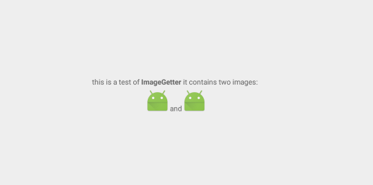

# 1. 使用ImageGetter的场景
   Android中用于显示文本的控件为textView，textView不仅仅能显示文本，同时也能显示富文本，即一些包含html标签的文本。
   
     //显示普通文本
     textView.setText("普通文本");
     //显示html富文本
     textView.setText(Html.fromHtml("<b>普通文本</b>"))
     //显示html富文本且包含图片
     textView.setText(Html.fromHtml("<b>普通文本</b></img>", imageGetter, tagHandler))

# 2. ImageGetter介绍
  
  
  ImageGetter是一个接口，主要用于解析 ""里的src属性，返回drawable，再使用drawable时需要确保drawable里有大小即Bounds

# 3. 简单示例 
*   新建activity

~~~java
public class TestImageGetter extends Activity {
    
private TextView tv;
private static final String url1 = "https://ss1.bdstatic.com/kvoZeXSm1A5BphGlnYG/newmusic/jingdianlaoge.png";
private static final String url2 = "https://ss0.bdstatic.com/k4oZeXSm1A5BphGlnYG/newmusic/lovesong.png";
    
@Override
protected void onCreate(@Nullable Bundle savedInstanceState) {
    super.onCreate(savedInstanceState);
    setContentView(R.layout.act_tv_demo);
    tv = (TextView) findViewById(R.id.tv);
    String source = "this is a test of <b>ImageGetter</b> it contains " +
            "two images:  " +
            "and" +
            "";
    MyImageGetter myImageGetter = new MyImageGetter();
    tv.setText(Html.fromHtml(source, myImageGetter, null));
}
    
class MyImageGetter implements Html.ImageGetter {
    
    @Override
    public Drawable getDrawable(String source) {
        Drawable drawable = getResources().getDrawable(R.mipmap.ic_launcher);
        drawable.setBounds(0, 0, drawable.getIntrinsicWidth(),
        drawable.getIntrinsicHeight());
        return drawable;
       }
    }
}
~~~
* 在AndroidManifest中注册activity

~~~xml
<activity android:name=".TestImageGetter">
    <intent-filter>
        <action android:name="android.intent.action.MAIN" />

        <category android:name="android.intent.category.LAUNCHER" />
    </intent-filter>
</activity>
~~~

* 运行后结果

  
  
# 4. 加载网络图片

选择目前android上加载图片比较好的框架：[Glide](https://github.com/bumptech/glide)
  
##   step1: 添加网络访问权限
  
  ~~~xml
    <uses-permission android:name="android.permission.INTERNET"></uses-permission>
  ~~~
  
##   step2: 添加类库
  
  ~~~java
   //project的build.gradle
   allprojects {
      repositories {
        jcenter()
        maven { url 'https://maven.google.com' }
      }
   }
   //module的build.gradle
   dependencies {
      compile 'com.github.bumptech.glide:glide:4.2.0'
   }
  ~~~
  
##   step3: 修改ImageGetter中getDrawable的实现方式
   
*    step3.1 自定义Drawable，因为ImageGetter接口返回的Drawable是不可变的，但是在加载网络图片完成后需要更新图片，因此在Drawable外加一个Wrapper
    
    ~~~java
        //查看ImageGetter接口
        //public static interface ImageGetter {           
        //    public Drawable getDrawable(String source);
        //}
        //实现DrawableWrapper
        class MyDrawableWrapper extends BitmapDrawable {
            private Drawable drawable;

            MyDrawableWrapper() {

            }

            @Override
            public void draw(Canvas canvas) {
                if (drawable != null)
                    drawable.draw(canvas);
            }

            public Drawable getDrawable() {
                return drawable;
            }
            public void setDrawable(Drawable drawable) {
                this.drawable = drawable;
            }
        }
    ~~~
    
* step3.2 利用Glide加载网络图片

  ~~~java
    class MyImageGetter implements Html.ImageGetter {
    
        @Override
        public Drawable getDrawable(String source) {
            MyDrawableWrapper myDrawable = new MyDrawableWrapper();
            Drawable drawable = getResources().getDrawable(R.mipmap.ic_launcher);
            drawable.setBounds(
                    0, 
                    0, 
                    drawable.getIntrinsicWidth(),
                    drawable.getIntrinsicHeight());
            myDrawable.setDrawable(drawable);
            Glide.with(TestImageGetter.this)
                    .asBitmap()
                    .load(source)
                    .into(new BitmapTarget(myDrawable));
            return myDrawable;
        }
    }
    
    
    class BitmapTarget extends SimpleTarget<Bitmap> {
        private final MyDrawableWrapper myDrawable;
        public BitmapTarget(MyDrawableWrapper myDrawable) {
            this.myDrawable = myDrawable;
        }
        @Override
        public void onResourceReady(Bitmap resource, Transition<? super Bitmap> transition) {
            Drawable drawable = new BitmapDrawable(getResources(), resource);
            //获取原图大小
            int width=drawable.getIntrinsicWidth() ;
            int height=drawable.getIntrinsicHeight();
            //自定义drawable的高宽, 缩放图片大小最好用matrix变化，可以保证图片不失真
            drawable.setBounds(0, 0, 500, 500);
            myDrawable.setBounds(0, 0, 500, 500);
            myDrawable.setDrawable(drawable);
            tv.setText(tv.getText());
            tv.invalidate();
        }
    }
  ~~~
  
*   step4 查看运行结果
  
  
# 5. 响应点击事件
>   假设有个需求需要点击图片后能够全屏查看，最简单的方法就是跳转到新的activity，因此就需要响应每个图片的点击事件

关键思路

    1. activity利用action去响应html的文本的点击事件即隐式启动activity
    2. 自定义html文本的规则，给每个需要添加
     “ <a href = "ACTION_STRING://?source=DATA">(或者其他的标签)</a>”
    3. ACTION_STRING 为自定义需要响应的action
    4. source = DATA 为向另一个activity传递的数据

## 5.1 如何响应image的点击事件
> 因为整体为一个textView，因此给textView设置点击事件是不实际的，所以需要寻找另外的解决方案

*  方案一 ： 得到imageSpans 给每个imageSpans设置点击事件，但是这样只能处理图片

        Spanned spanned = Html.fromHtml();
        SpannableStringBuilder spannableStringBuilder = new SpannableStringBuilder(spanned)
        ImageSpan[] imageSpans = spannableStringBuilder.getSpans(0, spannableStringBuilder.length(), ImageSpan.class);
*  方案二 ： 在富文本上添加""的标签，点击后会发生一个action，activity根据Intent-filter来响应action，

## 5.2 activity去响应action
* step1 新建ImageActivity，跳转后的activity，全屏查看大图，并且设置需要响应的自定义action

~~~xml
<activity android:name=".ImageActivity">
    <intent-filter>
        <category android:name="android.intent.category.DEFAULT" />
        <action android:name="android.intent.action.VIEW" />
        <data android:scheme="com.lin.action.custom.image" />
    </intent-filter>
</activity>
~~~

* step2 修改TestImageGetterActivity的代码，添加响应事件，需要修改的只有 html富文本罢了

~~~java  
private TextView tv;
private static final String url1 = "https://ss1.bdstatic.com/kvoZeXSm1A5BphGlnYG/newmusic/jingdianlaoge.png";
private static final String url2 = "https://ss0.bdstatic.com/k4oZeXSm1A5BphGlnYG/newmusic/lovesong.png";
    // 添加需要响应的 action  
private static final String ACTION_IMAGE = "com.lin.action.custom.image";

@Override
protected void onCreate(@Nullable Bundle savedInstanceState) {
    super.onCreate(savedInstanceState);
    setContentView(R.layout.act_tv_demo);
    tv = (TextView) findViewById(R.id.tv);
    
    // 在每个html的image标签 或者说 需要添加点击响应事件的文本添加
    // <a href ="ACTION_STRING://?source=data">
    String source = "this is a test of <b>ImageGetter</b> it contains " +
            "two images:  " +
            "<a href=\"" + ACTION_IMAGE + "://?source=" + url1 + "\">" +
            "</a>" +
            " and " +
            "<a href=\"" + ACTION_IMAGE + "://?source=" + url2 + "\">" +
            "</a>";
    MyImageGetter myImageGetter = new MyImageGetter();
    tv.setText(Html.fromHtml(source, myImageGetter, null));
    tv.setMovementMethod(LinkMovementMethod.getInstance());
}
~~~

# 6. 查看运行结果
  
  
# 7. 需要改进
* 如何高效的缩放图片 -- 利用matrix
* 如何去响应html文本中视频或者音频 -- 同样parse html，生成不同的action，区别处理
* activity是如何响应action的 -- 隐式启动activity，平时选择照片或者打电话都是隐式启动
  具体可以查阅官网
  

    
